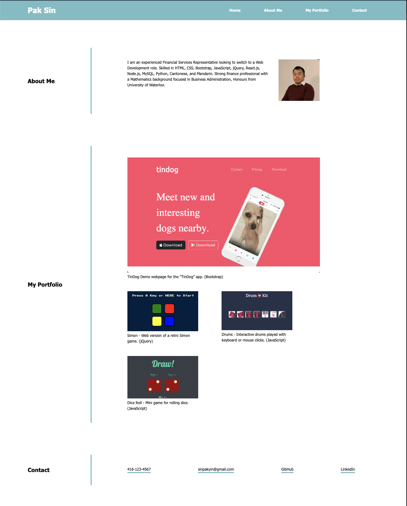
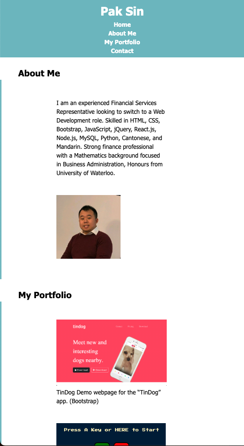

# 02-Advanced-CSS-Challenge

Deployed URL: https://paksin.github.io/02-Advanced-CSS-Challenge/

This challenge is a portfolio of work that could showcase our skills and talents to employers looking to fill a part-time or full-time position. An effective portfolio highlights our strongest work as well as the thought processes behind it. The site includes both Full-size and Mobile-size to accommodate different device users. 

At size 1700px and above, the app should resemble the following image:

At size 700px and below, the app should resemble the following image:

